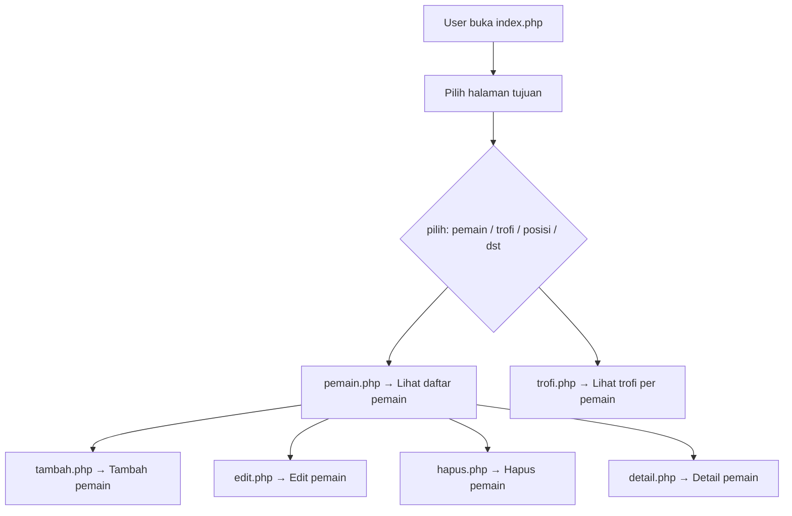

# Real Madrid Dashboard ⚽

Dashboard manajemen data pemain dan trofi Real Madrid yang dibangun menggunakan PHP murni tanpa framework. Desain elegan menggunakan Tailwind CSS CDN dengan efek SweetAlert2 untuk interaksi pengguna yang modern.

---

## 📁 Struktur Folder

```
real-madrid-dashboard/
├── index.php          # Dashboard utama + navigasi
├── db.php             # Koneksi database (menggunakan PDO)
├── .env               # File variabel lingkungan untuk keamanan
├── pemain.php         # Halaman daftar pemain
├── trofi.php          # Halaman daftar trofi
├── posisi.php         # Halaman posisi pemain
├── negara.php         # Halaman negara pemain
├── musim.php          # Halaman musim bermain
├── tambah.php         # Tambah data pemain
├── edit.php           # Edit data pemain
├── hapus.php          # Hapus data pemain
├── detail.php         # Detail data pemain
├── README.md          # Dokumentasi proyek
```

---

## 🔐 .env (Contoh)

```
DB_HOST=localhost
DB_NAME=yourdatabse
DB_USER=root
DB_PASS=yourpassword
```

Pastikan file `.env` ditambahkan ke `.gitignore` agar tidak terpublikasi di GitHub.

---

## 🔗 ERD (Entity Relationship Diagram)

```
[ pemain ]
- id (PK)
- nama
- posisi
- negara
- musim

[ trofi ]
- id (PK)
- nama_trofi
- musim
- pemain_id (FK) → pemain.id
```

Relasi:

- Satu pemain bisa punya banyak trofi (One-to-Many)

---

## 🔄 Alur Aplikasi (Flowchart)



---

## ✨ Fitur

- Dashboard utama elegan (Tailwind CSS)
- CRUD lengkap untuk data pemain
- Tampilan detail pemain
- SweetAlert2 untuk notifikasi sukses / error
- Struktur modular dan aman (PDO + .env)

---

## ⚙️ Teknologi yang Digunakan

- PHP 7.4+ (Native, tanpa framework)
- Tailwind CSS CDN (styling modern)
- SweetAlert2 (notifikasi interaktif)
- PDO (keamanan koneksi database)

---

## 🛠️ Setup & Instalasi

1. Clone repo ini

```bash
git clone https://github.com/namamu/real-madrid-dashboard.git
```

2. Buat file `.env`

```env
DB_HOST=localhost
DB_NAME=yourdatabse
DB_USER=root
DB_PASS=yourpassword
```

3. Import SQL berikut ke MySQL:

```sql
CREATE DATABASE IF NOT EXISTS real_madrid;
USE real_madrid;

CREATE TABLE pemain (
  id INT AUTO_INCREMENT PRIMARY KEY,
  nama VARCHAR(100),
  posisi VARCHAR(50),
  negara VARCHAR(50),
  musim VARCHAR(20)
);

CREATE TABLE trofi (
  id INT AUTO_INCREMENT PRIMARY KEY,
  nama_trofi VARCHAR(100),
  musim VARCHAR(20),
  pemain_id INT,
  FOREIGN KEY (pemain_id) REFERENCES pemain(id)
);
```

4. Jalankan proyek via localhost/web server (XAMPP / Laragon)

---

## 🧪 Data Dummy

```sql
INSERT INTO pemain (nama, posisi, negara, musim) VALUES
('Luka Modric', 'Gelandang', 'Kroasia', '2024/2025'),
('Vinicius Jr', 'Penyerang', 'Brasil', '2024/2025');

INSERT INTO trofi (nama_trofi, musim, pemain_id) VALUES
('La Liga', '2024/2025', 1),
('Champions League', '2024/2025', 1),
('Copa del Rey', '2024/2025', 2);
```

---

## 🙏 Kredit

Proyek ini dibuat oleh izi van satoru ini berbasis open source

Proyek ini open-source dan bebas digunakan untuk edukasi atau modifikasi.

---

Jika kamu butuh bantuan, custom, atau pengembangan fitur baru, silakan buka issue atau pull request! 💻
